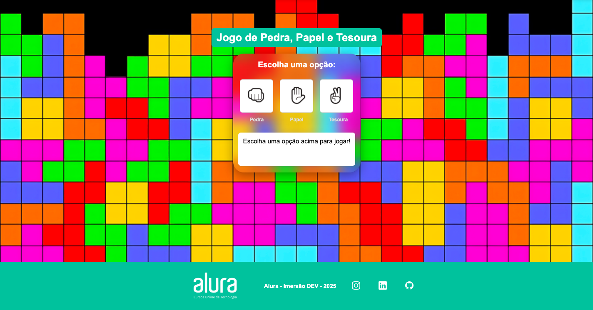

# 🪨📄✂️ Jokenpô - Imersão Dev Alura 2025 

Bem-vindo ao **Jokenpô**, um jogo interativo de Pedra, Papel e Tesoura desenvolvido durante a **Imersão Dev da Alura 2025**! 👽💚🎮

## 🎯 Sobre o Projeto

Este projeto foi criado com **HTML, CSS e JavaScript** para praticar conceitos de lógica de programação e interatividade na web.

## Funcionalidades

✅ Verificação de idade antes de jogar (18+)
✅ Escolha interativa com imagens para Pedra, Papel ou Tesoura
✅ Mensagem dinâmica exibindo o resultado da partida
✅ Design responsivo e estilizado com CSS

## 🛠️ Tecnologias Utilizadas

- HTML5 
- CSS3 
- JavaScript ⚡
- Bootstrap Icons 

## ⚡ Acesso ao Site  

O projeto está disponível aqui no link abaixo:  

🔗 [Jokenpô](https://esthernascimento.github.io//)  

## 📸 Prévia do Projeto

##  💚 Créditos

Projeto desenvolvido por **Esther Nascimento** durante a **Imersão Dev da Alura - 2025**. 🏆

📌 Me siga nas redes sociais:  
  
  
  

 *Divirta-se jogando!* 👽✨
